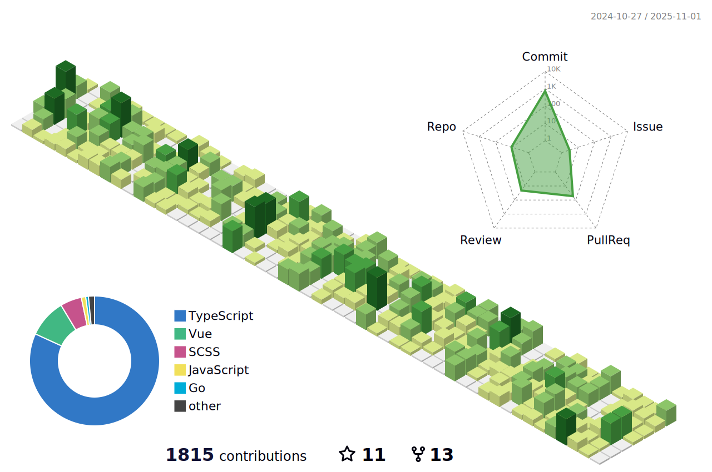

<h3 align="left">Connect with me:</h3>

## Languages and Tools

| Skill Set & Experience | Tech |
|--------------------------------------------------|------------------------------------------------------------------------------------------------------------------------------------------------------------------------------------------------------------------------------------------------------------------------------------------------------------------------------------------------------------------------------------------------------------------------------------------------------------------------------------------------------------------------------------------------------------------------------------------------------------------------------------------------------------------------------------------------------------------------------------------------------------------------------------------------------------------------------------------------------------------------------------------------------------------------------------------------------------------------------------------------------------------------------------------------------------------------------------------------------------------------------------------------------------------------------------------------------------------------------------------------------------------------------------------------------------------------------------------------------------------------------------------------------------------------------------------------------------------------------------------------------------------------------------------------------------------------------------------------------------------------------------------------------------------------------------------------------|
| **Server-Side Development**                      |           |
| **Web Development**                              |              |
| **Web-3 & Blockchain Dev**                       |          |
| **Databases & DevOps**                           |          |
| **Scripting, Version Control & Unit Testing**    |          |

## Weekly Summary
<!--START_SECTION:waka-->

<!--END_SECTION:waka-->

## Statistics

&nbsp;

  

<!--   profile-green-animate -->

